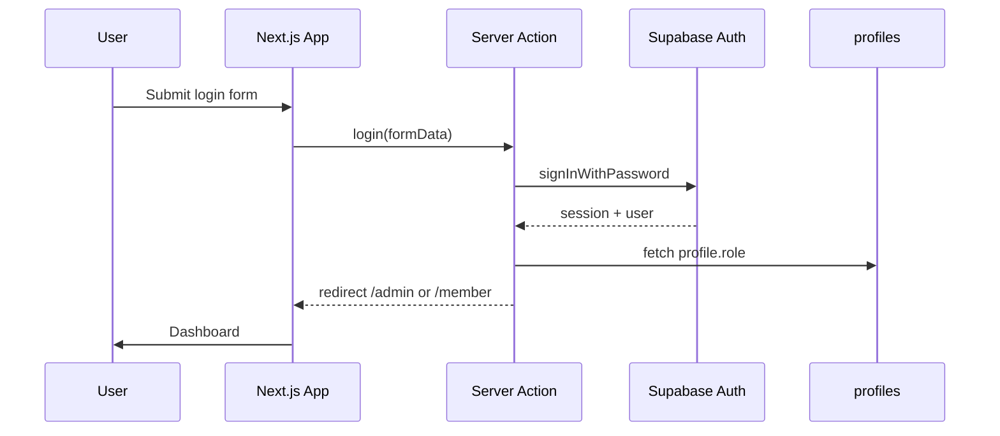

# Authentication

Lumintu Suite uses Supabase Auth with Server Actions and cookie-based sessions via `@supabase/ssr`.

## Flow overview

## Server Actions

All auth mutations live in `lib/auth/actions.ts`:

| Action | Purpose |
|--------|---------|
| `login` | Email/password sign-in, role-based redirect |
| `register` | Sign up with optional full name |
| `forgotPassword` | Send password reset email |
| `resetPassword` | Set new password from reset link |
| `signOut` | Clear session |

Forms use the native `action` prop — no client-side auth SDK for mutations.

## Session & middleware

`middleware.ts` runs on every matched request:

1. Refreshes the Supabase session (`lib/supabase/middleware.ts`)
2. Redirects unauthenticated users away from `/admin` and `/member`
3. Redirects authenticated users away from `/login`, `/register`, etc.
4. Enforces admin-only access on `/admin/*`
5. Sends members away from admin routes to `/member`

## Roles

Roles are stored in `public.profiles.role`:

- `admin` — access to `/admin/*`
- `member` — access to `/member/*`

New users default to `member`. Promote to admin via SQL (see [supabase-setup.md](./supabase-setup.md)).

## Password reset

1. User submits email on `/forgot-password`
2. Supabase sends email with link to `/auth/callback?code=...` → redirects to `/reset-password`
3. User sets a new password on `/reset-password`

Configure redirect URLs in Supabase before testing reset emails.

## Client usage

Use `createClient()` from `lib/supabase/client.ts` only when client-side Supabase access is required. Prefer Server Actions and server components for auth operations.
